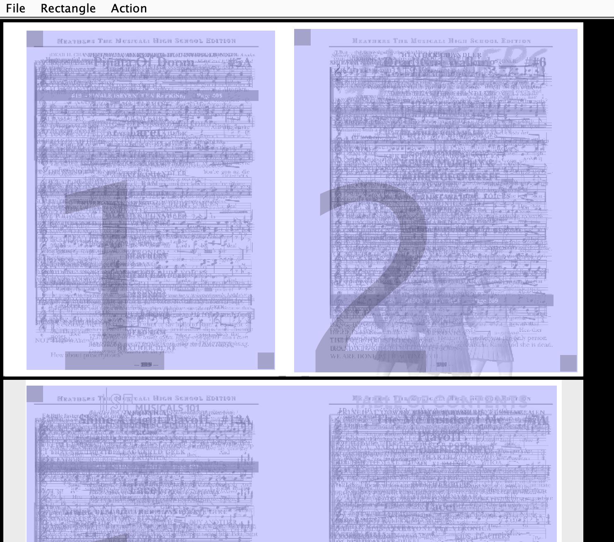
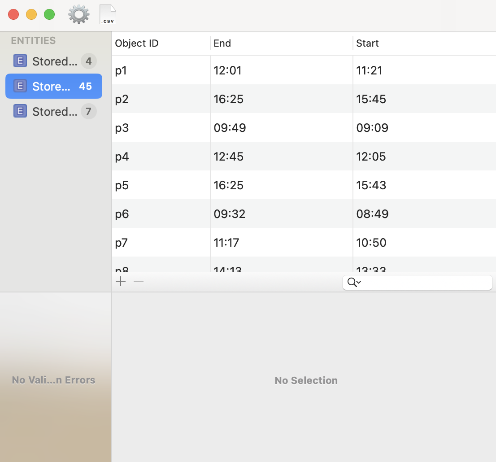
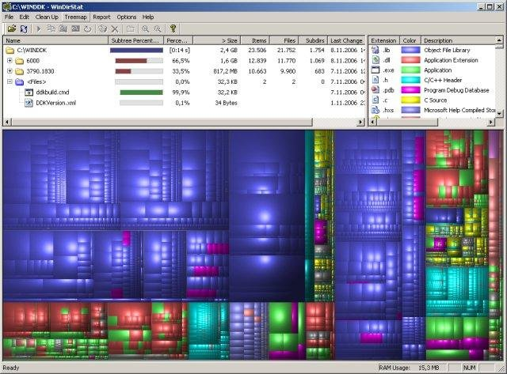

# Useful Programs

This is a list of programs curated by Dalton Harrold. I do not intend to infringe upon the rights of any of the authors of these programs and do not claim any ownership of them. This list is provided without warranty or guarantee. I cannot be held liable for any losses or damages incurred. 

## Why I Made this

I made this list because I spent lots of time trying to find freeware that was made by developers who know what they're doing. I also encountered another problem: once I found them, I would eventually lose them. Therefore, I now help maintain a list of programs I've found in the past. 

## How to use this

First, you should keep scrolling down to find links to updated versions of the software. I will not be maintaining versions of all the software consistently, so if there's an update, you'll need to get it directly from its developer. I only kept copies of the software from when I downloaded them in case they were later taken off their original website. If you find a newer edition, create a pull request and I'll be happy to merge it with main.

***
# List of software
## Briss 
Briss is a piece of software to help with splitting PDFs. It is really useful to split publisher booklet PDFs (Spread pages) into their original, full-page counterparts. Briss is a Jar file and can be run with `java -jar briss-0.9.jar [filename]`
* Developer: Gerhard Aigner
* [Briss Homepage](http://sourceforge.net/projects/briss/)
* License: GPLv3

## Core Data Editor
Core data editor is a Mac app designed to help developers debug and test their Core Data stores on iOS. Instead of using SQLite and navigating an endless hierarchy of security-randomized folders, Core Data Editor allows you to quickly view and edit your data at a glance.
Core Data Editor is a Mac app and can be either unzipped or built in Xcode using source code.
* Developer: Christian Kienle
* [Core Data Editor Homepage](https://github.com/ChristianKienle/Core-Data-Editor)
* License: BSD 3-clause

## WinDirStat
WinDirStat is a Windows directory statistics application to show what your disk space is being used for. The distinguishing feature of WinDirStat is its ability to graphically represent storage space.
WinDirStat is a Windows executable file and can be opened via file explorer.
* Developer: Bernhard
* [WinDirStat Homepage](https://windirstat.net/index.html)
* License: GPLv2

